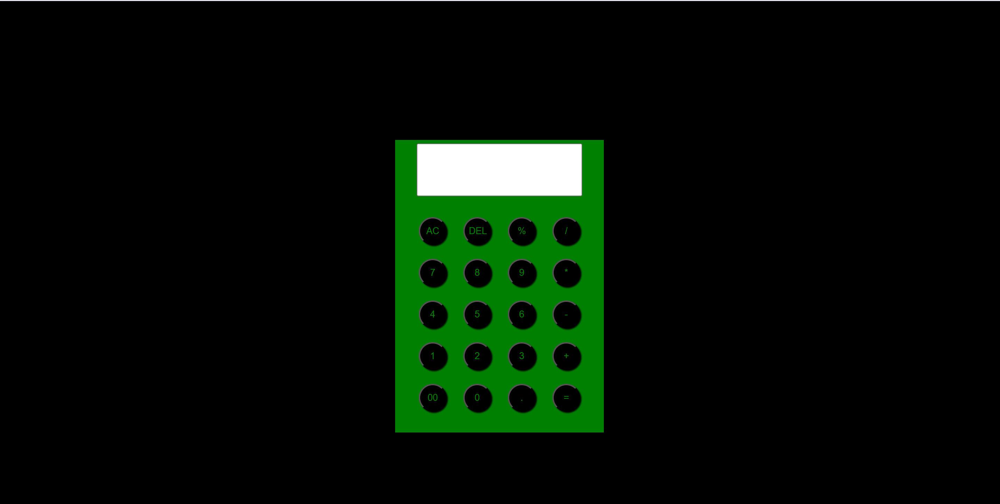

# Simple Calculator

I made a **Calculator** using **HTML**, **CSS**, and **JavaScript**.  
This project is a basic web-based calculator that performs simple arithmetic operations like addition, subtraction, multiplication, and division.

## 🔧 Technologies Used

- **HTML** – For the structure of the calculator
- **CSS** – For styling and layout
- **JavaScript** – For functionality and logic

## 🚀 Features

- User-friendly interface
- Supports:
  - Addition (`+`)
  - Subtraction (`-`)
  - Multiplication (`×`)
  - Division (`÷`)
- Clear button to reset input
- Responsive design for different screen sizes

## 📁 How to Use

1. Clone or download the repository.
2. Open `index.html` in any browser.
3. Use the buttons to input numbers and operations.
4. Press `=` to calculate the result.

## 💡 Screenshot

## 📌 Future Improvements

- Add keyboard support
- Add dark/light mode
- Show calculation history

---

Feel free to use or improve this project as you like! 😄
